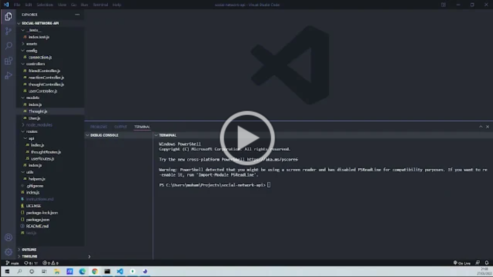
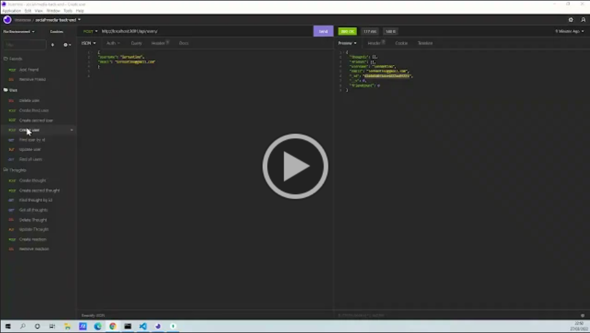
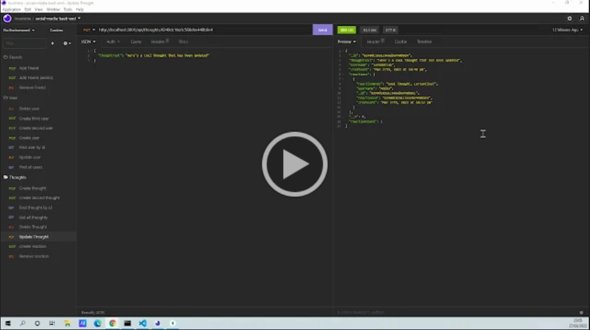
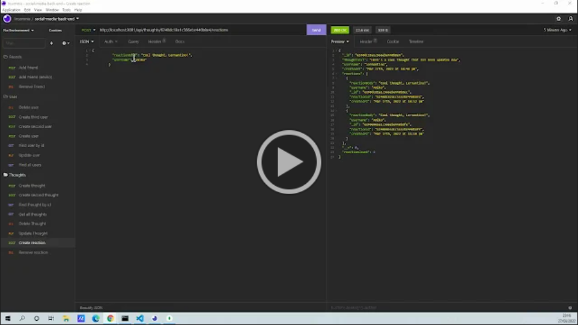

# social-network-api

[](https://opensource.org/licenses/MIT)

## Description

Task was to build an API for a social network web application where users can share their thoughts, react to friends’ thoughts, and create a friend list. The required stack includes Express.js for routing, a MongoDB database, and the Mongoose ODM. In addition to using the [Express.js](https://www.npmjs.com/package/express) and [Mongoose](https://www.npmjs.com/package/mongoose) packages, I have also used a native JavaScript `Date` object and Web API to format timestamps.

I have created a walkthrough video that demonstrates the functionality of the API using Insomnia after creating the API. A link to the video has been provided in the README below.

## Table of Contents

- [Description](#description)
- [Installation](#installation)
- [Usage](#usage)
- [Directory Structure](#directory-structure)
- [Technologies Used](#technologies-used)
- [Setup](#setup)
- [Demo](#demo)
- [Acknowledgements](#acknowledgements)
- [Questions](#questions)
- [License](#license)

## Installation

​Install dependencies using:

    npm install

## Usage

Need to have MongoDB and MongoDB Compass installed locally to run the app.

The application will then be invoked by using the following command:

    npm run watch

## Directory Structure

```md
.
├── config/
├── controllers/
├── models/
│ ├── Thought.js
│ ├── User.js
│ └── index.js
├── routes/
│ ├── api/
| | ├── thoughtRoutes.js
| | ├── userRoutes.js
| | └── index.js
│ └── index.js
├── utils/
├── .gitignore
├── README.md
├── LICENSE
├── package.json
├── README.md
└── index.js
```

## Technologies Used

- Node.js
- Express.js
- MongoDB
- Mongoose (ODM)

## Setup

- Nodejs must be installed
- MongoDB Compass must be installed
- Insomnia was used to test routes
- Text editor (VS Code recommended)

## Demo

### Part 1

This demos a general overview of the functionality of the api, and starts by demonstrating on how to invoke the application. I then explain how Mongoose syncs to MongoDB on server start, and go over the User and Thought models and their associated schemas and subdocuments. I also provide an brief over the getter method used to format dates, virtuals used, referenced models, self-references, and the objectId method to create a unique id value with a desired name:

[](https://drive.google.com/file/d/1751IHCK9kVsMLaaAFSCidX6goZxg1h4Z/view)

### Part 2

This demos POST User, POST Thought, POST friend, POST Reaction, GET Single User, GET Single Thought, Get All Thoughts, GET All Users. This also showcases a match validation for an incorrect email and formatted dates:

**`/api/users`**

- `GET` all users
- `GET` a single user by its `_id` and populated thought and friend data
- `POST` a new user

**`/api/users/userId`**

- `PUT` to update a user by its `_id`

**`/api/users/:userId/friends/:friendId`**

- `POST` to add a new friend to a user's friend list

**`/api/thoughts`**

- `GET` to get all thoughts
- `GET` to get a single thought by its `_id`
- `POST` to create a new thought (This also pushes the created thought's `_id` to the associated user's `thoughts` array field)

**`/api/thoughts/:thoughtId/reactions`**

- `POST` to create a reaction stored in a single thought's `reactions` array field

[](https://drive.google.com/file/d/137bDMWIz4FoUtAcI7-tdvxzbNXB6TtW_/view)

### Part 3

This demos PUT Thought, POST friend (second), DELETE friend:

**`/api/thoughts/thoughtId`**

- `PUT` to update a thought by its `_id`

**`/api/users/:userId/friends/:friendId`**

- `DELETE` to remove a friend from a user's friend list

[](https://drive.google.com/file/d/1Q0vKKx1Re6Ae_U4Kx0Z8n2j3PoNqkxvj/view)

### Part 4

This demos DELETE Reaction, DELETE Thought, DELETE User (and associated thoughts):

**`/api/thoughts/:thoughtId/reactions`**

- `DELETE` to pull and remove a reaction by the reaction's `reactionId` value

**`/api/thoughts/thoughtId`**

- `DELETE` to remove a thought by its `_id`

**`/api/users/userId`**

- `DELETE` to remove user by its `_id` and removes a user's associated thoughts when deleted.

[](https://drive.google.com/file/d/1Mbz2k0sMDzOk7h9L7TgZCGWuHDxYjVyD/view)

## Acknowledgements

- https://www.npmjs.com/package/mongoose
- https://www.npmjs.com/package/express
- https://www.npmjs.com/package/nodemon

## Questions

Created by: [@moedaaboul](https://github.com/moedaaboul)

Feel free to contact me via [muhammad.daaboul1989@gmail.com](muhammad.daaboul1989@gmail.com)!

## License

This work is licensed under
[MIT](#).
